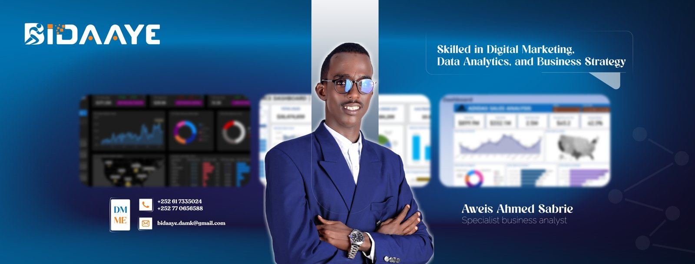
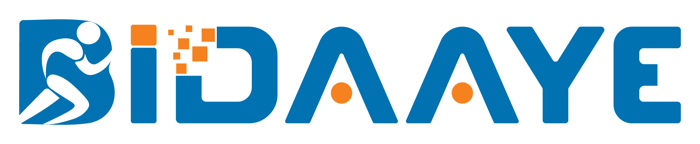

# Hi, I'm Aweis Ahmed Sabrie (Bidaaye)

**Skilled in Digital Marketing, Data Analytics, and Business Strategy**

  
  
  
  
  

---

## About Me

I'm Aweis, from Mogadishu, Somalia. I work on the HMIS / ICT team at the Directorate of Health and Human Services, Banadir Regional Administration, where we're moving public health facilities from paper registers to electronic records.

I'm now training to become an **AI engineer**, so I can build AI tools for digital health. I'm also doing a postgraduate degree at INTI International University.

---

## Tech Stack

**Languages & Data** 

**Health Information Systems** 

**Databases** 

**Learning: Backend, Frontend & DevOps** 

**Tools** 

---

## Featured Projects

| Project | What it is | Focus |
|---|---|---|
| [**it-support-knowledge-base**](https://github.com/Eng-Bidaaye/it-support-knowledge-base) | My IT support notes: troubleshooting guides, commands and ticket-style fixes from the Google IT Support Professional Certificate | Windows, networking, security, documentation |
| [**kulturehire-github-internship**](https://github.com/Eng-Bidaaye/kulturehire-github-internship) | Git practice from my KultureHire internship: branching, merging, fixing conflicts and working with a remote team | Git, GitHub, Git Bash |
| [**DataAnalysisportofio**](https://github.com/Eng-Bidaaye/DataAnalysisportofio) | My data analysis portfolio | Excel, SQL, Python, dashboards |

---

## Contact Me

- **Email:** [Bidaaye.damk@gmail.com](mailto:Bidaaye.damk@gmail.com)
- **Phone:** +252 61 7335024 · +252 77 0656588
- **WhatsApp:** [Message me on WhatsApp](https://wa.me/252617335024)
- **LinkedIn:** [aweis-ahmed-sabria](https://www.linkedin.com/in/aweis-ahmed-sabria-795b24224/)
- **Facebook:** [aways.haaji.7](https://www.facebook.com/aways.haaji.7)
- **Portfolio:** [KultureHire portfolio](https://kulturehire.com/portfolio/aweis-ahmad-sabrie)

**Open to work and collaboration in digital health, data and AI. Let's connect.**

